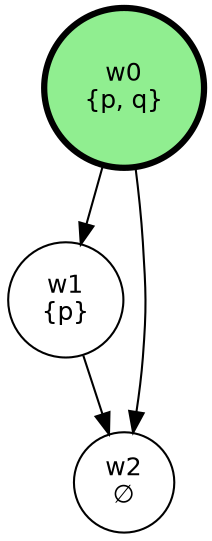

# Modal Logic

[](https://hex.pm/packages/modal_logic)
[](https://hexdocs.pm/modal_logic/)
[](https://github.com/justin4957/foil/actions)
[](https://opensource.org/licenses/MIT)


> A comprehensive Gleam library for modal logic analysis, formalization, and validation. Transform natural language arguments into formal modal logic, validate them using Z3/SMT solvers, and get actionable repair suggestions.

## Features


### Core Capabilities

| Feature | Description |
|---------|-------------|
| **Modal Logic Formalization** | Translate natural language arguments to formal modal logic |
| **7 Logic Systems** | Support for K, T, K4, S4, S5, KD, KD45 |
| **SMT Validation** | Validate arguments using Z3 solver integration |
| **Countermodel Generation** | Generate Kripke models that demonstrate invalidity |
| **Repair Suggestions** | Intelligent suggestions to fix invalid arguments |
| **Multi-Format Visualization** | Export to Mermaid, Graphviz, LaTeX, Markdown |

### Architecture Layers

```
┌─────────────────────────────────────────────────────────────┐
│                    User Interface Layer                      │
│         (REST API, WebSocket, CLI, Web Interface)            │
├─────────────────────────────────────────────────────────────┤
│                   Analysis & Repair Layer                    │
│      (Explanation Generator, Repair Suggestions, Graphs)     │
├─────────────────────────────────────────────────────────────┤
│                    Validation Layer                          │
│         (Z3/SMT Integration, Countermodel Generation)        │
├─────────────────────────────────────────────────────────────┤
│                   Translation Layer                          │
│    (LLM Prompts, Compiler, Logic Detection, Translation)     │
├─────────────────────────────────────────────────────────────┤
│                    Persistence Layer                         │
│           (Repository, Cache, Graph Analysis)                │
├─────────────────────────────────────────────────────────────┤
│                      Domain Layer                            │
│            (Propositions, Arguments, Logic Systems)          │
└─────────────────────────────────────────────────────────────┘
```

## Installation

```sh
gleam add modal_logic@1
```

## Quick Start

### Basic Usage

```gleam
import modal_logic/proposition.{Atom, Implies, Necessary, K}
import modal_logic/argument.{Argument, Formalization}
import modal_logic/validator

pub fn main() {
  // Create a simple modal logic argument
  // □(p → q), □p ⊢ □q (Modus Ponens under necessity)
  let formalization = Formalization(
    id: "modus-ponens-1",
    argument_id: "arg-1",
    logic_system: K,
    premises: [
      Necessary(Implies(Atom("p"), Atom("q"))),  // □(p → q)
      Necessary(Atom("p")),                       // □p
    ],
    conclusion: Necessary(Atom("q")),             // □q
    assumptions: [],
    validation: None,
    created_at: None,
    updated_at: None,
  )

  // Validate the argument
  let config = validator.default_config()
  let result = validator.validate(formalization, config)

  // Handle the result
  case result {
    argument.Valid -> io.println("✓ Argument is valid!")
    argument.Invalid(countermodel) -> {
      io.println("✗ Argument is invalid")
      io.println("Countermodel: " <> countermodel)
    }
    _ -> io.println("Validation error")
  }
}
```

### Using the CLI

```bash
# Analyze a natural language argument
gleam run -m cli -- analyze "All men are mortal. Socrates is a man. Therefore, Socrates is mortal."

# Validate a formal argument
gleam run -m cli -- validate --premises "□(p→q),□p" --conclusion "□q" --system K

# Interactive mode
gleam run -m cli -- interactive

# Export visualization
gleam run -m cli -- export mermaid output.md
```

### REST API

```bash
# Start the API server
gleam run -m api

# Analyze an argument
curl -X POST http://localhost:8080/api/analyze \
  -H "Content-Type: application/json" \
  -d '{"text": "All men are mortal. Socrates is a man. Therefore, Socrates is mortal."}'

# Validate a formalization
curl -X POST http://localhost:8080/api/validate \
  -H "Content-Type: application/json" \
  -d '{"premises": ["□(p→q)", "□p"], "conclusion": "□q", "system": "K"}'

# List available logic systems
curl http://localhost:8080/api/systems
```

## Modal Logic Systems


| System | Axioms | Frame Properties | Use Cases |
|--------|--------|------------------|-----------|
| **K** | K: □(p→q) → (□p→□q) | None | Basic modal reasoning |
| **T** | K + T: □p → p | Reflexive | Alethic necessity |
| **K4** | K + 4: □p → □□p | Transitive | - |
| **S4** | K + T + 4 | Reflexive + Transitive | Knowledge, provability |
| **S5** | K + T + 5: ◇p → □◇p | Equivalence relation | Metaphysical necessity |
| **KD** | K + D: □p → ◇p | Serial | Deontic logic (obligations) |
| **KD45** | K + D + 4 + 5 | Serial + Transitive + Euclidean | Deontic S5 |

## Module Overview

### Domain Layer
- **`proposition.gleam`** - Core proposition types (Atom, Not, And, Or, Implies, Necessary, Possible, etc.)
- **`argument.gleam`** - Argument and formalization types with validation results

### Translation Layer
- **`prompts.gleam`** - LLM prompt templates for natural language translation
- **`compiler.gleam`** - Compiles LLM JSON output to internal types
- **`logic_detector.gleam`** - Detects appropriate logic system from text
- **`translation_service.gleam`** - Service layer for LLM translation with retries

### Validation Layer
- **`validator.gleam`** - Orchestrates validation using Z3 solver
- **`cache.gleam`** - In-memory caching for validation results
- **`countermodel.gleam`** - Formats countermodels for human consumption

### Analysis Layer
- **`execution.gleam`** - Self-correcting execution loop with repair application
- **`explanation.gleam`** - Generates human-readable explanations
- **`repair.gleam`** - Generates repair suggestions for invalid arguments
- **`graph.gleam`** - Graph-based analysis of argument relationships

### Persistence Layer
- **`repository.gleam`** - Data access layer for PostgreSQL

### Interface Layer
- **`api.gleam`** - REST API with OpenAPI spec generation
- **`websocket.gleam`** - WebSocket support for real-time updates
- **`cli.gleam`** - Command-line interface
- **`web.gleam`** - Web interface with HTML generation
- **`visualization.gleam`** - Export to Mermaid, Graphviz, LaTeX, Markdown

## Visualization Examples

### Kripke Model (Mermaid)

```mermaid
graph TB
    w0((w0<br/>{p, q}))
    w1((w1<br/>{p}))
    w2((w2<br/>∅))
    w0 --> w1
    w0 --> w2
    w1 --> w2
    style w0 fill:#90EE90,stroke:#228B22,stroke-width:3px
    subgraph Legend
        system["System: T"]
    end
```

### Graphviz Output



### LaTeX/TikZ Output

```latex
\begin{tikzpicture}[scale=1.0,
    every node/.style={circle, draw, minimum size=1.5cm},
    actual/.style={fill=green!30, very thick},
    ->{Stealth}]

    \node[actual] (w0) at (0,0) {w0\\{p, q}};
    \node (w1) at (4,0) {w1\\{p}};
    \node (w2) at (8,0) {w2\\∅};

    \draw (w0) -- (w1);
    \draw (w0) -- (w2);
    \draw (w1) -- (w2);
\end{tikzpicture}
```

## Validation Results


### Valid Argument Example

```
✓ VALID in S4

Premises:
  1. □(bachelor → unmarried)
  2. john_bachelor

Conclusion:
  ∴ john_unmarried

Explanation: The conclusion follows necessarily from the premises
in all possible worlds under the S4 logic system.
```

### Invalid Argument with Countermodel

```
✗ INVALID in K

Premises:
  1. ◇p

Conclusion:
  ∴ □p

Countermodel (actual world: w0):

Worlds:
  w0: {p} / ¬{}
  w1: {} / ¬{p}

Relations:
  w0 → w1

Explanation: The argument is invalid because there exists a world w1
accessible from w0 where p is false, showing that ◇p does not imply □p.

Repair Suggestions:
  • [AddPremise] Add □◇p as a premise (confidence: 0.8)
  • [ChangeLogicSystem] Use S5 instead of K (confidence: 0.7)
  • [StrengthenPremise] Replace ◇p with □p (confidence: 0.6)
```

## API Reference

### Proposition Types

```gleam
pub type Proposition {
  Atom(String)                              // Atomic proposition
  Not(Proposition)                          // Negation
  And(Proposition, Proposition)             // Conjunction
  Or(Proposition, Proposition)              // Disjunction
  Implies(Proposition, Proposition)         // Implication
  Necessary(Proposition)                    // □ (box/necessity)
  Possible(Proposition)                     // ◇ (diamond/possibility)
  Obligatory(Proposition)                   // Deontic obligation
  Permitted(Proposition)                    // Deontic permission
  Knows(agent: String, Proposition)         // Epistemic knowledge
  Believes(agent: String, Proposition)      // Epistemic belief
}
```

### Logic Systems

```gleam
pub type LogicSystem {
  K       // Basic modal logic
  T       // Reflexive
  K4      // Transitive
  S4      // Reflexive + Transitive
  S5      // Equivalence relation
  KD      // Serial (deontic)
  KD45    // Deontic S5
}
```

### Validation Results

```gleam
pub type ValidationResult {
  Valid                     // Argument is valid
  Invalid(String)           // Invalid with countermodel
  Timeout                   // Solver timeout
  Error(String)             // Validation error
}
```

## Development

```sh
# Build the project
gleam build

# Run all tests
gleam test

# Run specific test modules
gleam run -m translation_test
gleam run -m validation_test
gleam run -m persistence_test
gleam run -m interface_test

# Format code
gleam format src test

# Generate documentation
gleam docs build
```

## Testing

The package includes comprehensive tests across all layers:

| Test Module | Coverage |
|------------|----------|
| `translation_test` | LLM prompts, compilation, logic detection |
| `validation_test` | SMT generation, countermodels, repairs, explanations |
| `persistence_test` | Repository, cache, graph queries |
| `interface_test` | API, WebSocket, CLI, Web, Visualization |

See [docs/TESTING.md](docs/TESTING.md) for detailed QA testing procedures.

## Dependencies

**Production:**
- `gleam_stdlib` >= 0.67.0
- `gleam_json` >= 3.0.0

**Development:**
- `gleeunit` >= 1.0.0

## Contributing

1. Fork the repository
2. Create a feature branch (`git checkout -b feature/amazing-feature`)
3. Make your changes
4. Run tests (`gleam test`)
5. Format code (`gleam format src test`)
6. Commit your changes
7. Push to the branch
8. Open a Pull Request

## License

This project is licensed under the MIT License - see the [LICENSE](LICENSE) file for details.

## Acknowledgments


- Built with [Gleam](https://gleam.run/)
- SMT solving powered by [Z3](https://github.com/Z3Prover/z3)
- Part of the [FOIL](https://github.com/justin4957/foil) project

---

Made with ❤️ for modal logic enthusiasts
